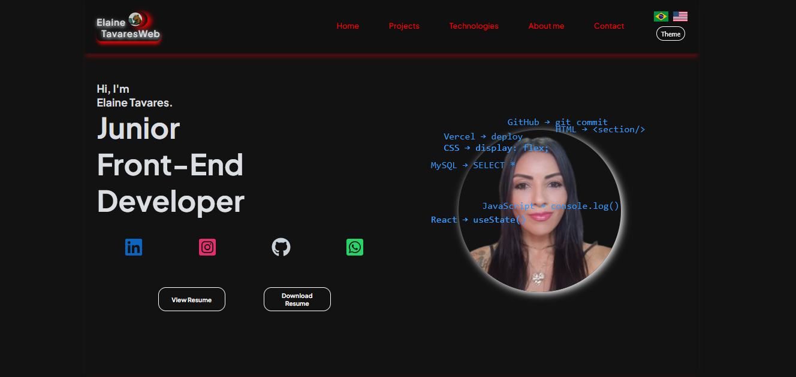
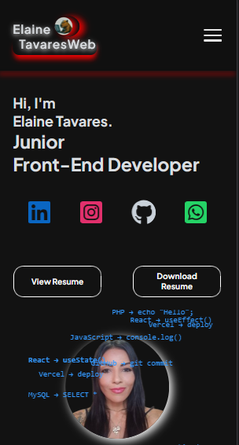

# Portfólio - Elaine Tavares | Desenvolvedora Front-End 
  Este é o meu portfólio profissional como Desenvolvedora Front-End, criado para apresentar meus projetos, habilidades e evolução na área de desenvolvimento web.

  O projeto foi desenvolvido com foco em boas práticas, organização de código e experiência do usuário.

  Aqui você pode conhecer meus principais projetos, minhas habilidades técnicas e um pouco sobre minha trajetória na tecnologia.


## Preview 
  ### 🌐 Acesse o projeto online:
  https://elainetavaresweb.com

  ### Desktop: 
  

  ### Mobile:  
  


## Tecnologias utilizadas
  ### Front-end
    - React
    - JavaScript
    - HTML5
    - CSS Modules

  ### Back-end
    - PHP
    - MySQL
    - API REST

  ### Outras ferramentas e recursos
    - Axios
    - Git e GitHub
    - LocalStorage
    - Internacionalização (i18n)
    - Responsividade
    - React Icons

## Funcionalidades
  - Apresentação de projetos desenvolvidos
  - Interface responsiva para diferentes dispositivos
  - Navegação entre seções do site
  - Formulário de contato com integração backend
  - Armazenamento de dados em banco MySQL
  - Integração com API REST
  - Internacionalização com suporte a Português e Inglês (i18n)
  - Persistência de dados com LocalStorage

## Como rodar o projeto
 1. Clonar o repositório
 ```bash
  git clone https://github.com/Elaine-Tavares/portfolio_elaine_tavares.git
 ```

 2. Instalar dependências do frontend
 ```bash
  npm install
 ```

 3. Iniciar o frontend
 ```bash
  npm run dev
 ```

  O projeto estará disponível em: http://localhost:5173
  
 4. Configurar o backend
  O backend foi desenvolvido em PHP com banco de dados MySQL. É necessário: 
    - Servidor local (XAMPP, WAMP ou similar)
    - MySQL configurado

 Importe o banco de dados e configure o arquivo de conexão com as credenciais locais.

## Aprendizados 
  Durante o desenvolvimento deste portfólio, aprimorei conhecimentos importantes como:
  - Desenvolvimento de aplicações com React
  - Organização e reutilização de componentes
  - Integração entre frontend (React) e backend (PHP)
  - Criação e consumo de APIs REST
  - Estruturação de projetos para produção
  - Internacionalização de aplicações (i18n)
  - Persistência de dados com LocalStorage
  - Estilização com CSS Modules

## Autora
  Elaine Tavares
  LinkedIn: https://www.linkedin.com/in/elainetavaresweb/
